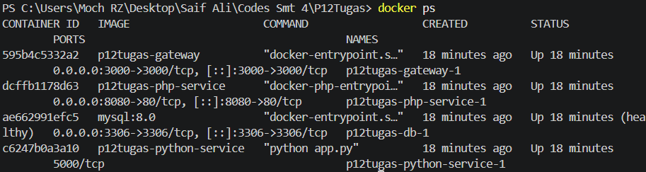
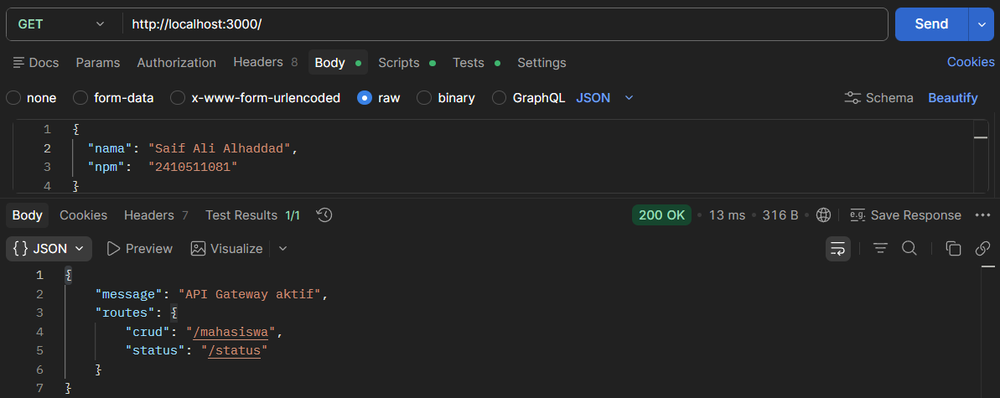
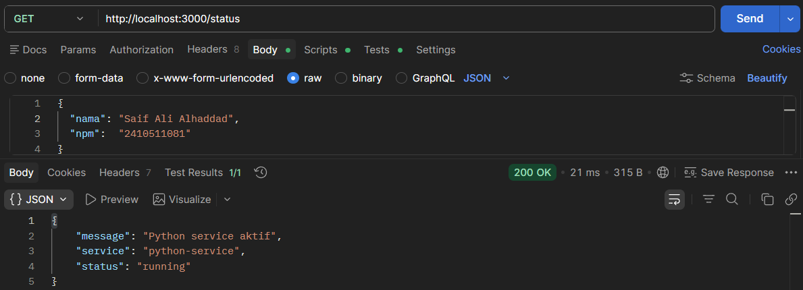
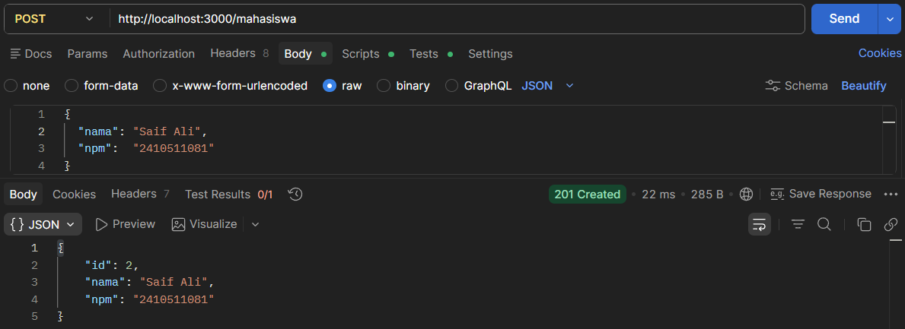
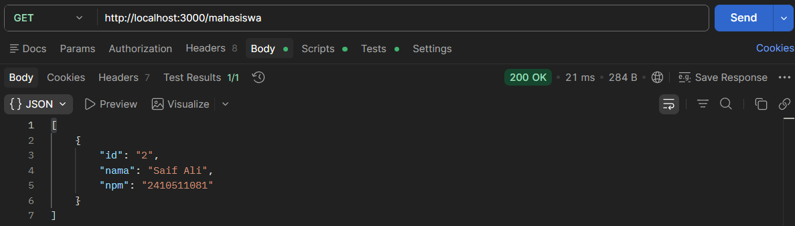
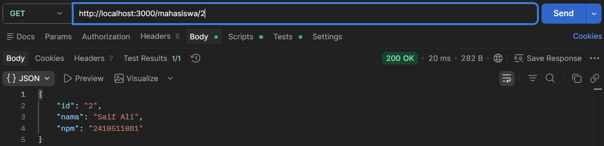
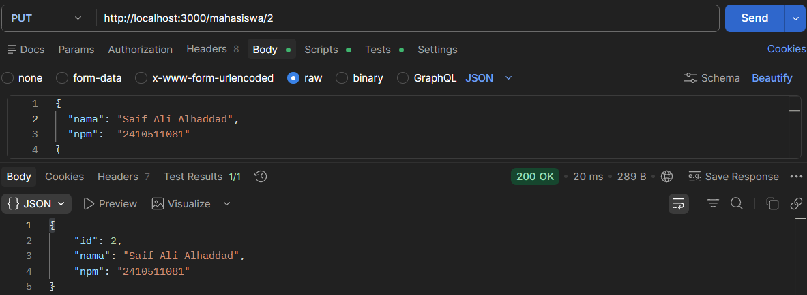
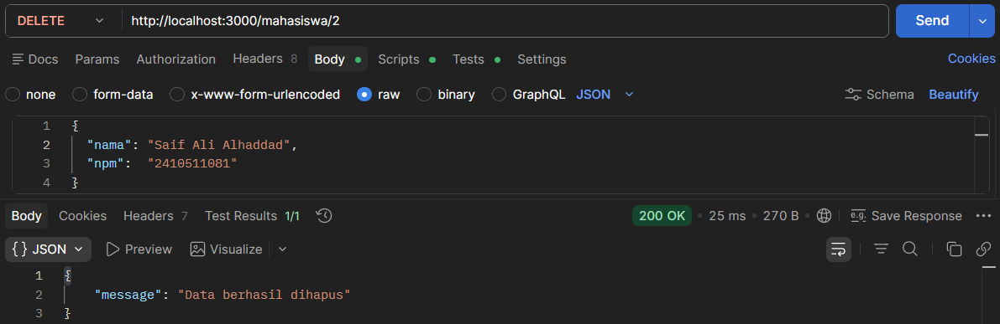

# Docker Containerization

Aplikasi CRUD multi-service yang dikontainerisasi menggunakan Docker Compose. Menggunakan Node.js sebagai API Gateway, PHP untuk operasi database, Python sebagai service tambahan, dan MySQL sebagai database.

---

## Arsitektur

```
Postman / Browser
      │
      ▼
┌─────────────────────┐
│  Node.js (Express)  │  ← API Gateway  (port 3000)
└─────────┬───────────┘
          │
    ┌─────┴──────┐
    ▼            ▼
┌──────────┐  ┌──────────────┐
│  PHP     │  │   Python     │
│ Service  │  │   Service    │
│ (port    │  │  (port 5000) │
│  8080)   │  └──────────────┘
└────┬─────┘
     ▼
┌──────────┐
│  MySQL   │
│  (3306)  │
└──────────┘
```

| Service | Stack | Peran |
|---|---|---|
| Gateway | Node.js + Express | Menerima semua request dari client, meneruskan ke service yang sesuai |
| PHP Service | PHP 8.2 CLI | Menangani logika CRUD dan koneksi ke MySQL |
| Python Service | Python + Flask | Service status check |
| Database | MySQL 8.0 | Menyimpan data |

---

## Struktur Folder

```
pplos-docker-containerization/
├── docker-compose.yml
├── README.md
├── screenshots/
│   ├── 01_docker_ps.png
│   ├── 02_get_root.png
│   ├── 03_get_status.png
│   ├── 04_post_mahasiswa.png
│   ├── 05_get_all_mahasiswa.png
│   ├── 06_get_one_mahasiswa.png
│   ├── 07_put_mahasiswa.png
│   └── 08_delete_mahasiswa.png
├── gateway/
│   ├── Dockerfile
│   ├── package.json
│   └── app.js
├── php-service/
│   ├── Dockerfile
│   └── index.php
└── python-service/
    ├── Dockerfile
    ├── requirements.txt
    └── app.py
```

---

## Cara Menjalankan

### Prasyarat
- Docker Desktop sudah terinstall dan running

### Jalankan Semua Service

```bash
docker-compose up --build
```

Tunggu hingga semua container running, lalu cek:

```bash
docker ps
```

Harus muncul 4 container: `gateway`, `php-service`, `python-service`, `db`.



### Menghentikan Service

```bash
# Hentikan semua container
docker-compose down

# Hentikan + hapus data MySQL
docker-compose down -v
```

---

## API Endpoints

Semua request dikirim ke **Gateway port 3000**.

### Cek Gateway
```
GET http://localhost:3000/
```


---

### Cek Python Service
```
GET http://localhost:3000/status
```


---

### Tambah Data
```
POST http://localhost:3000/mahasiswa
Content-Type: application/json
```


---

### Lihat Semua Data
```
GET http://localhost:3000/mahasiswa
```


---

### Lihat Satu Data
```
GET http://localhost:3000/mahasiswa/1
```


---

### Update Data
```
PUT http://localhost:3000/mahasiswa/1
Content-Type: application/json
```


---

### Hapus Data
```
DELETE http://localhost:3000/mahasiswa/1
```
